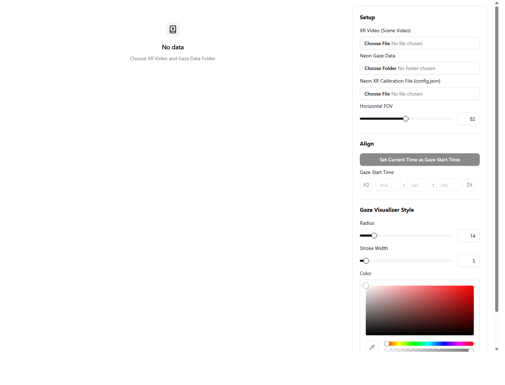
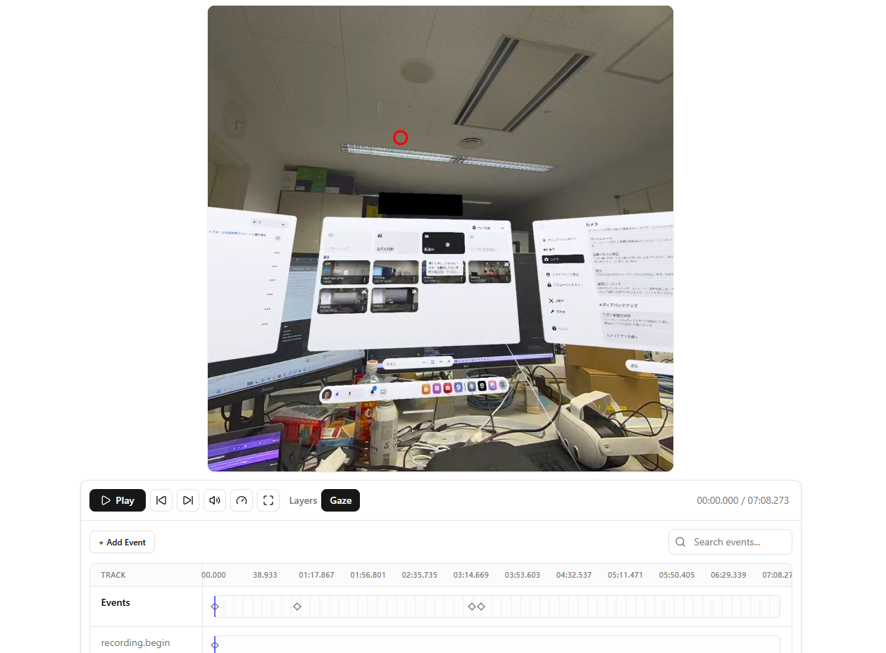

# Neon XR Posthoc Player

Neon XR Posthoc Player is a local review tool for aligning Neon XR scene videos with gaze data, projecting gaze onto the video frame, and annotating review events on a shared timeline.

The app runs entirely in the browser. You load a scene video, a folder containing Neon export files, and a calibration `config.json`, then review playback with a gaze overlay and editable event markers.

## Screenshots





## What It Does

- Loads a local XR scene video file
- Loads Neon gaze data from a selected folder
- Projects gaze using azimuth/elevation data plus the XR calibration config
- Lets you align gaze timing to the video with direct time input and frame stepping
- Shows custom video controls with playback speed, volume, fullscreen, and frame-by-frame navigation
- Displays an event timeline for review annotations
- Loads existing `events.csv` data when present
- Writes timeline edits back to `events.csv` automatically when directory-handle access is available
- Lets you tune the gaze overlay radius, stroke width, color, and horizontal FOV

## Requirements

- Node.js 20+ recommended
- npm
- A Chromium-based browser is the safest choice for local folder access

The app uses browser file APIs such as `showDirectoryPicker`. In browsers that do not support it, folder selection falls back to a regular directory input, but automatic write-back support may be limited.

## Getting Started

Install dependencies:

```bash
npm install
```

Start the dev server:

```bash
npm run dev
```

The app runs on `http://localhost:3000`.

## Available Scripts

```bash
npm run dev
npm run build
npm run preview
npm run test
npm run lint
npm run format
npm run check
```

`npm run check` formats the repo and applies ESLint fixes.

## Review Workflow

1. Load the scene video file.
2. Choose the Neon timeline data export folder.
3. Load the XR calibration `config.json`.
4. Adjust the horizontal FOV if needed.
5. Set or fine-tune the gaze start time.
6. Review the overlay and add, rename, or delete timeline events.

If the selected folder contains an `events.csv`, the timeline is initialized from that file. Timeline edits are then serialized back to `events.csv`.

## Expected Input Files

### Scene Video

Any in-headset Quest 3 video recording can be used as the scene recording. However, it has only been tested with the Square 1:1 resolution, only capturing one eye.

Meta Quest Developer Hub's recording feature has not been tested with the player, but it may be inaccurate due to the barrel distortion still present in MQDH recordings.

### Neon Export Folder

The selected folder should contain:

- `gaze.csv` required
- `events.csv` optional

### Calibration File

- `config.json` required

This file is used to build the gaze projector so azimuth/elevation samples can be mapped into video coordinates. The file contains the pose offset of the neon module from the Quest 3 headset. This is generatable from [Neon's MRTK3 Template project](https://docs.pupil-labs.com/neon/neon-xr/MRTK3-template-project/#quest-3), with the calibration scene.

Calibration is only necessary once for the official Neon XR Quest 3 headset mount, and once per session for the other neon modules (e.g., Pupil Neon ready-set-go model).

## `gaze.csv` Format

The gaze parser expects header-based CSV data and requires these columns:

- `timestamp [ns]`
- `azimuth [deg]`
- `elevation [deg]`

The gaze ray is calculated and reprojected into the XR scene video using these data. Do note that the gaze ray already assumes binocular vision, despite the monocular video recording of the XR scene.

It also reads these columns when available:

- `section id`
- `recording id`
- `gaze x [px]`
- `gaze y [px]`
- `worn`
- `fixation id`
- `blink id`

Rows with invalid required numeric values are ignored. Parsed samples are sorted by timestamp before playback.

## `events.csv` Format

The app reads and writes `events.csv` using this header:

```csv
recording id,timestamp [ns],name,type
```

Two event names are treated as reserved timeline markers:

- `recording.begin`
- `recording.end`

These can be displayed but not manually renamed or deleted from the UI.

## Notes

- Gaze alignment is stored in milliseconds and can be nudged by detected video frame duration.
- If the browser loads the video but does not expose video dimensions, the app prompts for manual width and height so projection can still be initialized.
- Event timestamps shown in the timeline are normalized to the current gaze start offset, while saved `events.csv` output is written back in the original recording time base.

## Stack

- React 19
- TanStack Router / Start
- TypeScript
- Vite
- Zustand
- Tailwind CSS 4
- Radix UI
